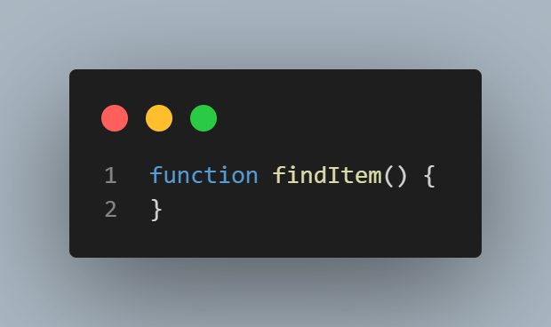
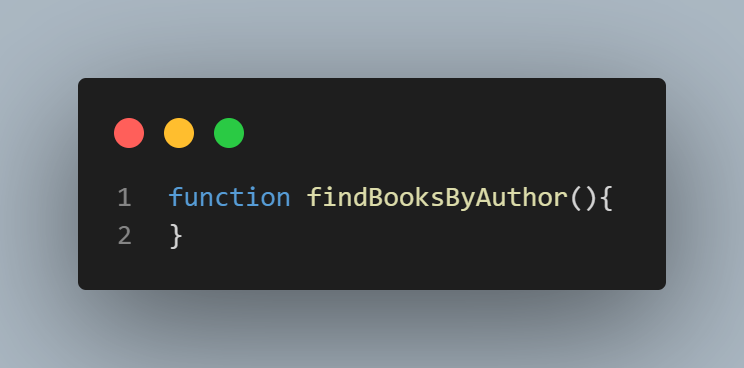
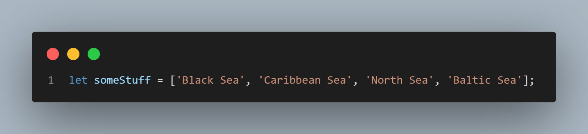
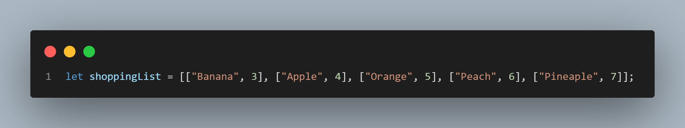
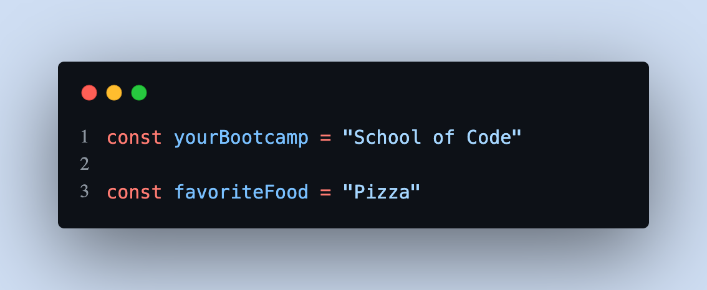
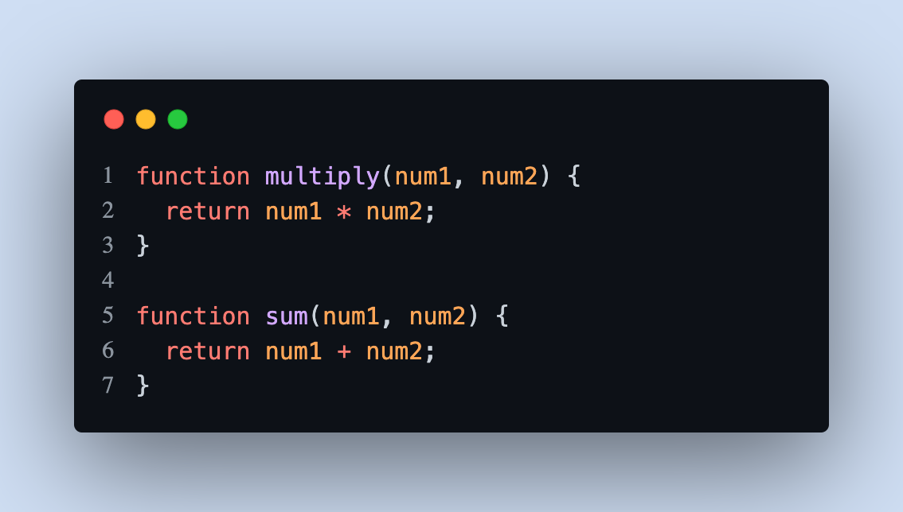
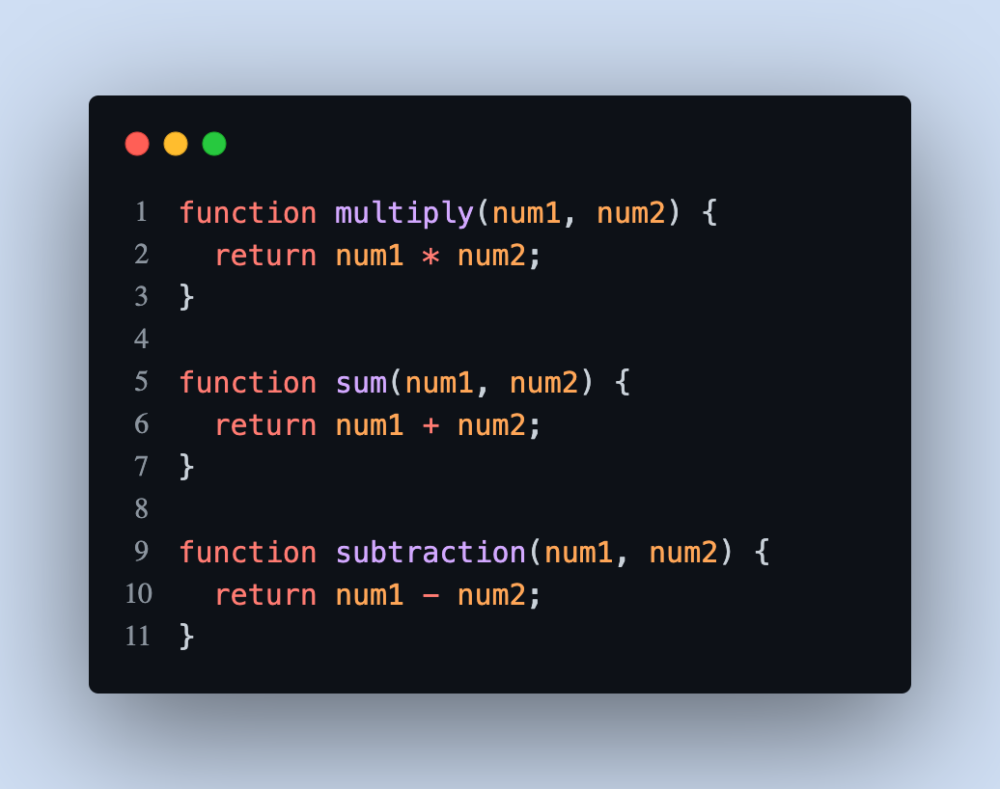
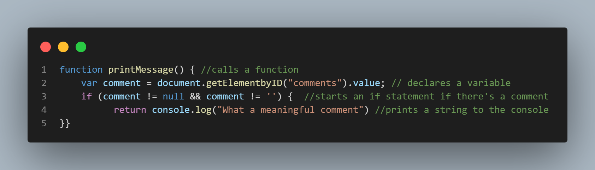
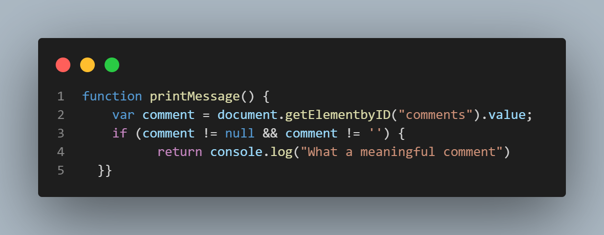

# Styling and Formatting Guide

 

## Table of Contents 

1. [Introduction](#introduction)
2. [Naming Conventions](#Naming_Conventions)
3. [Indentation & Spcacing](#Indentation_And_Spacing)
4. [Brackets & Colons](#objects-and-data-structures)
5. [Comments](#classes)
6. [Code Formatter](#Code_formatters)

## Introduction
In this article, we will look at how to format your code and why it's important.
\
Code Formatting is not necessary for functionality but well formatted code is easier to read not just by you but other developers. It can also help make errors in your code more obvious.
\
Good code should be self-explanatory, easy to understand and easy to change or extend.

## **Naming Conventions**

### Always use meaningful and descriptive names for variables and functions.

#### Function Names

**Bad:**

**Good:**

#### Variable Names 

**Bad:**

**Good:**

**[⬆ back to top](#table-of-contents)**

## **Indentation-And-Spacing**

Always remember code is read more than they are written. Your code will run without indentation and spacing but it does makes your code easier to read and can help with finding errors in your code easier.

Below are some examples of how indentation and spacing is used with JavaScript. (CHECK WORDING)

### Variables
Variables should always start on the same line.

**Bad Indentation:**

**Good Indentation:**

### Functions
Also functions of the same level should alwasys start on the same line and keep spacing constant when writing code.

**Bad Indentation:**

**Good Indentation:**

**Bad Spacing:**

**Good Spacing:**

**[⬆ back to top](#table-of-contents)**

## **Comments**

### How to leave comments like a pro!

Comments save time, help other developers navigate through your code and help your future self understand what you had written.\ 
This is espically true when you are learning, although less is more when it comes to comments, as good code should be self-documenting.

#### As you can see from the examples below, comment overkill can be overwhelming and take to long to read through and understand.

**Bad:**

**Good:**

**[⬆ back to top](#table-of-contents)**

## **Code Formatters**

