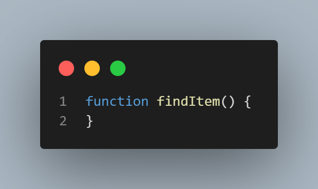
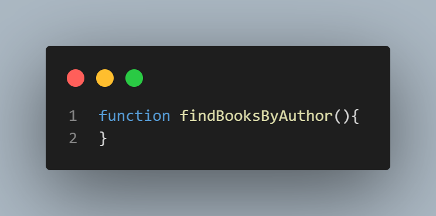

# Styling and Formatting Guide

 

## Table of Contents 

1. [Introduction](#introduction)
2. [Naming Conventions](#Naming_Conventions)
3. [Indentation & Spcacing](#Indentation_And_Spacing)
4. [Brackets & Colons](#objects-and-data-structures)
5. [Comments](#classes)
6. [Code Formatter](#solid)
<!-- 7. [Testing](#testing)
8. [Concurrency](#concurrency)
9. [Error Handling](#error-handling)
10. [Formatting](#formatting)
11. [Comments](#comments)
12. [Translation](#translation) -->

## Introduction

Well formatted code makes it easier to read and make errors more obvious. Code that is easy to read is easier to understand by you as well as other developers.
It should be self-explanatory, easy to understand and easy to change or extend.

In this article, we will look at how and why code formatting is important.


## **Naming Conventions**

 

### Always use meaningful and descriptive names for variables and functions.

**Bad:**



**Good:**




**[⬆ back to top](#table-of-contents)**


## **Indentation-And-Spacing**

Always remember code is read more than they are written. Your code will run without indentation and spacing but it does makes your code easier to read and can help with finding errors in your code easier.

Below are some examples of how indentation and spacing is used with JavaScript. (CHECK WORDING)

### Variables
Variables should always start on the same line.

**Bad Indentation:**


**Good Indentation:**


### Functions
Also functions of the same level should alwasys start on the same line and keep spacing constant when writing code.

**Bad Indentation:**


**Good Indentation:**


**Bad Spacing:**


**Good Spacing:**


**[⬆ back to top](#table-of-contents)**

### Functions should do one thing

This is by far the most important rule in software engineering. When functions
do more than one thing, they are harder to compose, test, and reason about.
When you can isolate a function to just one action, it can be refactored
easily and your code will read much cleaner. If you take nothing else away from
this guide other than this, you'll be ahead of many developers.

**Bad:**

```javascript
function emailClients(clients) {
  clients.forEach(client => {
    const clientRecord = database.lookup(client);
    if (clientRecord.isActive()) {
      email(client);
    }
  });
}
```

**Good:**

```javascript
function emailActiveClients(clients) {
  clients.filter(isActiveClient).forEach(email);
}

function isActiveClient(client) {
  const clientRecord = database.lookup(client);
  return clientRecord.isActive();
}
```

**[⬆ back to top](#table-of-contents)**

### Function names should say what they do

**Bad:**

```javascript
function addToDate(date, month) {
  // ...
}

const date = new Date();

// It's hard to tell from the function name what is added
addToDate(date, 1);
```

**Good:**

```javascript
function addMonthToDate(month, date) {
  // ...
}

const date = new Date();
addMonthToDate(1, date);
```

**[⬆ back to top](#table-of-contents)**

### Functions should only be one level of abstraction

When you have more than one level of abstraction your function is usually
doing too much. Splitting up functions leads to reusability and easier
testing.

**Bad:**

```javascript
function parseBetterJSAlternative(code) {
  const REGEXES = [
    // ...
  ];

  const statements = code.split(" ");
  const tokens = [];
  REGEXES.forEach(REGEX => {
    statements.forEach(statement => {
      // ...
    });
  });

  const ast = [];
  tokens.forEach(token => {
    // lex...
  });

  ast.forEach(node => {
    // parse...
  });
}
```

**Good:**

```javascript
function parseBetterJSAlternative(code) {
  const tokens = tokenize(code);
  const syntaxTree = parse(tokens);
  syntaxTree.forEach(node => {
    // parse...
  });
}

function tokenize(code) {
  const REGEXES = [
    // ...
  ];

  const statements = code.split(" ");
  const tokens = [];
  REGEXES.forEach(REGEX => {
    statements.forEach(statement => {
      tokens.push(/* ... */);
    });
  });

  return tokens;
}

function parse(tokens) {
  const syntaxTree = [];
  tokens.forEach(token => {
    syntaxTree.push(/* ... */);
  });

  return syntaxTree;
}
```

**[⬆ back to top](#table-of-contents)**

### Remove duplicate code

Do your absolute best to avoid duplicate code. Duplicate code is bad because it
means that there's more than one place to alter something if you need to change
some logic.

Imagine if you run a restaurant and you keep track of your inventory: all your
tomatoes, onions, garlic, spices, etc. If you have multiple lists that
you keep this on, then all have to be updated when you serve a dish with
tomatoes in them. If you only have one list, there's only one place to update!

Oftentimes you have duplicate code because you have two or more slightly
different things, that share a lot in common, but their differences force you
to have two or more separate functions that do much of the same things. Removing
duplicate code means creating an abstraction that can handle this set of
different things with just one function/module/class.

Getting the abstraction right is critical, that's why you should follow the
SOLID principles laid out in the _Classes_ section. Bad abstractions can be
worse than duplicate code, so be careful! Having said this, if you can make
a good abstraction, do it! Don't repeat yourself, otherwise you'll find yourself
updating multiple places anytime you want to change one thing.

**Bad:**

```javascript
function showDeveloperList(developers) {
  developers.forEach(developer => {
    const expectedSalary = developer.calculateExpectedSalary();
    const experience = developer.getExperience();
    const githubLink = developer.getGithubLink();
    const data = {
      expectedSalary,
      experience,
      githubLink
    };

    render(data);
  });
}

function showManagerList(managers) {
  managers.forEach(manager => {
    const expectedSalary = manager.calculateExpectedSalary();
    const experience = manager.getExperience();
    const portfolio = manager.getMBAProjects();
    const data = {
      expectedSalary,
      experience,
      portfolio
    };

    render(data);
  });
}
```

**Good:**

```javascript
function showEmployeeList(employees) {
  employees.forEach(employee => {
    const expectedSalary = employee.calculateExpectedSalary();
    const experience = employee.getExperience();

    const data = {
      expectedSalary,
      experience
    };

    switch (employee.type) {
      case "manager":
        data.portfolio = employee.getMBAProjects();
        break;
      case "developer":
        data.githubLink = employee.getGithubLink();
        break;
    }

    render(data);
  });
}
```

**[⬆ back to top](#table-of-contents)**


### Don't write to global functions

Polluting globals is a bad practice in JavaScript because you could clash with another
library and the user of your API would be none-the-wiser until they get an
exception in production. Let's think about an example: what if you wanted to
extend JavaScript's native Array method to have a `diff` method that could
show the difference between two arrays? You could write your new function
to the `Array.prototype`, but it could clash with another library that tried
to do the same thing. What if that other library was just using `diff` to find
the difference between the first and last elements of an array? This is why it
would be much better to just use ES2015/ES6 classes and simply extend the `Array` global.

**Bad:**

```javascript
Array.prototype.diff = function diff(comparisonArray) {
  const hash = new Set(comparisonArray);
  return this.filter(elem => !hash.has(elem));
};
```

**Good:**

```javascript
class SuperArray extends Array {
  diff(comparisonArray) {
    const hash = new Set(comparisonArray);
    return this.filter(elem => !hash.has(elem));
  }
}
```

**[⬆ back to top](#table-of-contents)**

### Favor functional programming over imperative programming

JavaScript isn't a functional language in the way that Haskell is, but it has
a functional flavor to it. Functional languages can be cleaner and easier to test.
Favor this style of programming when you can.

**Bad:**

```javascript
const programmerOutput = [
  {
    name: "Uncle Bobby",
    linesOfCode: 500
  },
  {
    name: "Suzie Q",
    linesOfCode: 1500
  },
  {
    name: "Jimmy Gosling",
    linesOfCode: 150
  },
  {
    name: "Gracie Hopper",
    linesOfCode: 1000
  }
];

let totalOutput = 0;

for (let i = 0; i < programmerOutput.length; i++) {
  totalOutput += programmerOutput[i].linesOfCode;
}
```

**Good:**

```javascript
const programmerOutput = [
  {
    name: "Uncle Bobby",
    linesOfCode: 500
  },
  {
    name: "Suzie Q",
    linesOfCode: 1500
  },
  {
    name: "Jimmy Gosling",
    linesOfCode: 150
  },
  {
    name: "Gracie Hopper",
    linesOfCode: 1000
  }
];

const totalOutput = programmerOutput.reduce(
  (totalLines, output) => totalLines + output.linesOfCode,
  0
);
```

**[⬆ back to top](#table-of-contents)**

### Encapsulate conditionals

**Bad:**

```javascript
if (fsm.state === "fetching" && isEmpty(listNode)) {
  // ...
}
```

**Good:**

```javascript
function shouldShowSpinner(fsm, listNode) {
  return fsm.state === "fetching" && isEmpty(listNode);
}

if (shouldShowSpinner(fsmInstance, listNodeInstance)) {
  // ...
}
```

**[⬆ back to top](#table-of-contents)**

### Avoid negative conditionals

**Bad:**

```javascript
function isDOMNodeNotPresent(node) {
  // ...
}

if (!isDOMNodeNotPresent(node)) {
  // ...
}
```

**Good:**

```javascript
function isDOMNodePresent(node) {
  // ...
}

if (isDOMNodePresent(node)) {
  // ...
}
```

**[⬆ back to top](#table-of-contents)**


### Avoid conditionals

This seems like an impossible task. Upon first hearing this, most people say,
"how am I supposed to do anything without an `if` statement?" The answer is that
you can use polymorphism to achieve the same task in many cases. The second
question is usually, "well that's great but why would I want to do that?" The
answer is a previous clean code concept we learned: a function should only do
one thing. When you have classes and functions that have `if` statements, you
are telling your user that your function does more than one thing. Remember,
just do one thing.

**Bad:**

```javascript
class Airplane {
  // ...
  getCruisingAltitude() {
    switch (this.type) {
      case "777":
        return this.getMaxAltitude() - this.getPassengerCount();
      case "Air Force One":
        return this.getMaxAltitude();
      case "Cessna":
        return this.getMaxAltitude() - this.getFuelExpenditure();
    }
  }
}
```

**Good:**

```javascript
class Airplane {
  // ...
}

class Boeing777 extends Airplane {
  // ...
  getCruisingAltitude() {
    return this.getMaxAltitude() - this.getPassengerCount();
  }
}

class AirForceOne extends Airplane {
  // ...
  getCruisingAltitude() {
    return this.getMaxAltitude();
  }
}

class Cessna extends Airplane {
  // ...
  getCruisingAltitude() {
    return this.getMaxAltitude() - this.getFuelExpenditure();
  }
}
```

**[⬆ back to top](#table-of-contents)**

### Avoid type-checking (part 1)

JavaScript is untyped, which means your functions can take any type of argument.
Sometimes you are bitten by this freedom and it becomes tempting to do
type-checking in your functions. There are many ways to avoid having to do this.
The first thing to consider is consistent APIs.

**Bad:**

```javascript
function travelToTexas(vehicle) {
  if (vehicle instanceof Bicycle) {
    vehicle.pedal(this.currentLocation, new Location("texas"));
  } else if (vehicle instanceof Car) {
    vehicle.drive(this.currentLocation, new Location("texas"));
  }
}
```

**Good:**

```javascript
function travelToTexas(vehicle) {
  vehicle.move(this.currentLocation, new Location("texas"));
}
```

**[⬆ back to top](#table-of-contents)**

### Avoid type-checking (part 2)

If you are working with basic primitive values like strings and integers,
and you can't use polymorphism but you still feel the need to type-check,
you should consider using TypeScript. It is an excellent alternative to normal
JavaScript, as it provides you with static typing on top of standard JavaScript
syntax. The problem with manually type-checking normal JavaScript is that
doing it well requires so much extra verbiage that the faux "type-safety" you get
doesn't make up for the lost readability. Keep your JavaScript clean, write
good tests, and have good code reviews. Otherwise, do all of that but with
TypeScript (which, like I said, is a great alternative!).

**Bad:**

```javascript
function combine(val1, val2) {
  if (
    (typeof val1 === "number" && typeof val2 === "number") ||
    (typeof val1 === "string" && typeof val2 === "string")
  ) {
    return val1 + val2;
  }

  throw new Error("Must be of type String or Number");
}
```

**Good:**

```javascript
function combine(val1, val2) {
  return val1 + val2;
}
```

**[⬆ back to top](#table-of-contents)**

### Don't over-optimize

Modern browsers do a lot of optimization under-the-hood at runtime. A lot of
times, if you are optimizing then you are just wasting your time. [There are good
resources](https://github.com/petkaantonov/bluebird/wiki/Optimization-killers)
for seeing where optimization is lacking. Target those in the meantime, until
they are fixed if they can be.

**Bad:**

```javascript
// On old browsers, each iteration with uncached `list.length` would be costly
// because of `list.length` recomputation. In modern browsers, this is optimized.
for (let i = 0, len = list.length; i < len; i++) {
  // ...
}
```

**Good:**

```javascript
for (let i = 0; i < list.length; i++) {
  // ...
}
```

**[⬆ back to top](#table-of-contents)**

### Remove dead code

Dead code is just as bad as duplicate code. There's no reason to keep it in
your codebase. If it's not being called, get rid of it! It will still be safe
in your version history if you still need it.

**Bad:**

```javascript
function oldRequestModule(url) {
  // ...
}

function newRequestModule(url) {
  // ...
}

const req = newRequestModule;
inventoryTracker("apples", req, "www.inventory-awesome.io");
```

**Good:**

```javascript
function newRequestModule(url) {
  // ...
}

const req = newRequestModule;
inventoryTracker("apples", req, "www.inventory-awesome.io");
```

**[⬆ back to top](#table-of-contents)**

## **Comments**

 

### How to leave comments like a pro!

Comments save time, help other developers navigate through your code and help your future self understand what you had written.
Less is more when it comes to comments as good code should be self-documenting but comments can be very useful espically when learning to code.

#### As you can see from the examples below, comment overkill can be overwhelming to the eye and take to much time to read through and understand.

**Bad:**


**Good:**


### Don't leave commented out code in your codebase

Version control exists for a reason. Leave old code in your history. (REWRITE)

**Bad:**

```javascript
doStuff();
// doOtherStuff();
// doSomeMoreStuff();
// doSoMuchStuff();
```

**Good:**

```javascript
doStuff();
```

**[⬆ back to top](#table-of-contents)**


