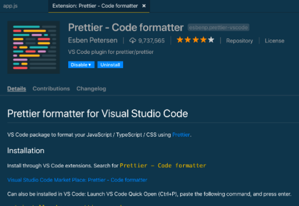

# Styling and Formatting Guide


## Table of Contents

1. [Introduction](#Introduction)
2. [Naming Conventions](#Naming-Conventions)
3. [Indentation & Spcacing](#Indentation-And-Spacing)
4. [Brackets & Colons](#Brackets)
5. [Comments](#Comments)
6. [Code Formatter](#Code_Formatters)

## **Introduction**

In this article, we will look at how to format your code and why it's important.

Code Formatting is not necessary for functionality but well formatted code is easier to read not just by you but other developers. It can also help make errors in your code more obvious.

Good code should be self-explanatory, easy to understand and easy to change or extend.

## Naming Conventions

### WHY NAMING CONVENTIONS ARE IMPORTANT:

Using descriptive names revels the intention of the code and reduces the effort needed to read that code and understand what it is doing.

Remember to always use meaningful names so your code speaks for itself.

### Function Names

**Bad:**

```js
function findItem() {}
```

**Good:**

```js
function findBooksByAuthor() {}
```

### Variable Names

**Bad:**

```js
let someStuff = ["Bananas", "Bread", "Cheese", "Crisps", "Milk"];
```

**Good:**

```js
let shoppingList = ["Bananas", "Bread", "Cheese", "Crisps", "Milk"];
```

**[⬆ back to top](#table-of-contents)**

## **Indentation-And-Spacing**

### Indentation

Indentation is the leading whitespace before any statement in javascript. Indentation is not so important in javascript because your code will run without it but good indentation helps improve code readability.

Statement with the same indentation level(whitespace) should be treated as a single code block.

#### Some examples that show how indentation can be used:

The indented code only runs if the conditoions are met. This shows the code is in a seperate code block.

```js
let myName = "Kazeem";
if (myName === "Kazeem") {
  console.log(myName); //this is indented because it's treated as a seperate code block.
}
myName = "Ade";
```

```js
const names = ["kazeem", "chris", "Liz"];
for (let i = 0; i < names.length; i++) {
  console.log(names[i]); //this is indented because it's treated as seperate code block.
}
```

### White Spacing.

White spacing makes your code readable and also makes it easy to find errors in your code.

Bad:

```js
const names=["kazeem", "chris", "Liz"];
const favouriteLanguage="Python";
```

Good:

```js
const names = ["kazeem", "chris", "Liz"];
const favouriteLanguage = "Python";
```

### Line Spacing.

It's important to be consistent with your line spacing when writing code because it makes your code easier to read.

Bad:
The line spacing between the functions are not consistent.

```js
function(num1,num2){
 console.log(num1*num2)
}
function(firstName){
console.log(firstName)
}

function(food){
console.log(food)
}
```

Good:
The line spacing between the functions are consistent.

```js
function(num1,num2){
 console.log(num1*num2)
}

function(firstName){
console.log(firstName)
}

function(food){
console.log(food)
}
```

## **Brackets**

There are three main types of brackets in javascript. They are parenthesis, square brackets and curly brackets. This section shows what they do and how you can use them.

#### Parenthesis ()

Parenthesis are mostly used to define function parameters but in some cases can also be used to define orders of evaluatin.

##### As you can see in the example below the parameters of the function are put in a parenthesis

When a function has a parameter it makes the function reuseable.

```js
function yourFavoriteMovie(movie) {}
```

##### Parenthesis also define order of evaluation in calculations.

```js
const answer = 4 * (2 + 3);
```

As you can see in the example above it evaluates 2+3 first (5) and then multiplies by 4 = 20.

##### Lastly, Parenthesis are required in For and While loops

The example below shows how parenthesis are used in both for and while loops.

While loop:

```js
let i = 0;
while (i < 10) {
  i++;
}
```

For loop:

```js
for (let i = 0; i < array.length; i++) {
  console.log(i);
}
```

#### Square Brackets []

Square brackets are often used to define an array and also get items from an array and objects.

The examples below shows how square brackets are used in javascript.

Defining an Array:

```js
const positiveNumbers = [1, 2, 3, 45, 6, 77];
```

Getting an item in an Array:

```js
const positiveNumbers = [1, 2, 3, 45, 6, 77];
positiveNumbers[0]; // gets 1 from the array
positiveNumbers[2]; // gets 3 from the array
```

Square bracket notation in objects:

Square brackets can be used to get the value of a key in an object. This does the same thing as using dot(.) notation to get the values.

```js
const coachesAge = { kazeem: 15, jordan: 18, arshi: 17 };
coachesAge["kazeem"]; //gets the value of kazeem from the object (15)
coachesAge["arshi"]; //gets the value of arshi from the object (17)
```

#### Curly Brackets {}

Curly brackets are used to open and close blocks of code. They declare when the function starts and end. Lastly, they are also used in defining objects.

The code in the curly bracket runs if the condition in the parenthesis is met.

```js
const yourName = "Kazeem";
if (yourName === "Kazeem") {
  console.log(yourName);
}
```

```js
let i = 0;
while (i < 10) {
  i++;
}
```

```js
for (let i = 0; i < array.length; i++) {
  console.log(i);
}
```

Lastly, Curly brackets are used to define objects.

```js
const coachesAge = { kazeem: 12, jordan: 15 };
```

**[⬆ back to top](#table-of-contents)**

## **Comments**

### How to leave comments like a pro!

Comments save time, help other developers navigate through your code and help your future self understand what you had written.

This is especially true when you are learning, although less is more when it comes to comments, as good code should be self-documenting.

In JavaScript you create a single-line comment with `// `  and multi-line comments using `/* and */ `.

#### As you can see from the examples below, comment overkill can be overwhelming and take to long to read through and understand.

**Bad:**

```js
function printMessage() {
  //calls a function
  const comment = document.getElementbyID("comments").value; // declares a variable
  if (comment != null && comment != "") {
    //starts an if statement if there's a comment
    return console.log("What a meaningful comment"); //prints a string to the console
  }
}
```

**Good:**

```js
//checks to see if there's a comment. If so, returns a message.
function printMessage() {
  const comment = document.getElementbyID("comments").value;
  if (comment != null && comment != "") {
    return console.log("What a meaningful comment");
  }
}
```

**[⬆ back to top](#table-of-contents)**

## **Code_Formatters**

### WHY WE USE FORMATTERS:

Remembering all the rules about code formatting can be taxing so thats where code formatters can help!

Code formatters automatically format code for you depending on the preferences you set. Automatic formatting enables higher code quality, especially when you are working in teams and other people are reading the code you’ve written.

Many developers maintain standards of code formatting like 2-space or 4-space indentation or using single or double quotes. This helps with both readbility and finding errors.

One such formatter is Prettier.

#### Step 1 - Install the extension in VS Code

To do this, search for Prettier - Code Formatter in the extension panel of VS Code. If you’re installing it for the first time, you’ll see an install button instead of the uninstall button shown here:


#### Step 2 - Run Prettier on a file

1. Open Files -> Preferences -> Settings (or Ctrl + , in Windows).
2. Search for Editor: Default Formatter
3. Select your default formatter as Prettier - Code Formatter;


#### Step 3 - Automatically run Prettier when saving a file

1. Open Files -> Preferences -> Settings (or Ctrl + , in Windows) to open the Settings menu.
2. Search for Editor: Format on Save
3. Click the check box under Format On Save;


#### Step 3 - Changing the Prettier Configuration Settings

Along with Prettier's default settings you can also customize your settings.

Open the Settings menu. Then, search for Prettier. This will show all of the settings that you can change:


Here are a few of the most common settings:

1. "singleQuote" - Choose between single and double-quotes.
2. "semi" - Choose whether or not to include semicolons at the end of lines.
3. "tabWidth" - Specify how many spaces you want a tab to insert.

#### Step 4 - Creating a Prettier Configuration File

Create a new file called .prettierrc.extension with a js extensions. For example, to set up a JavaScript config file you would use: _.prettierrc.js_

NOTE: Since Prettier will run for all files, its config file goes at the root of the repo.


For more details on Prettier, click the link to the documentation: https://prettier.io/docs/en/configuration.html

**[⬆ back to top](#table-of-contents)**
