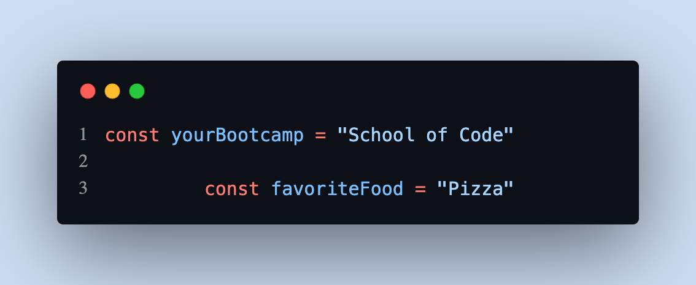
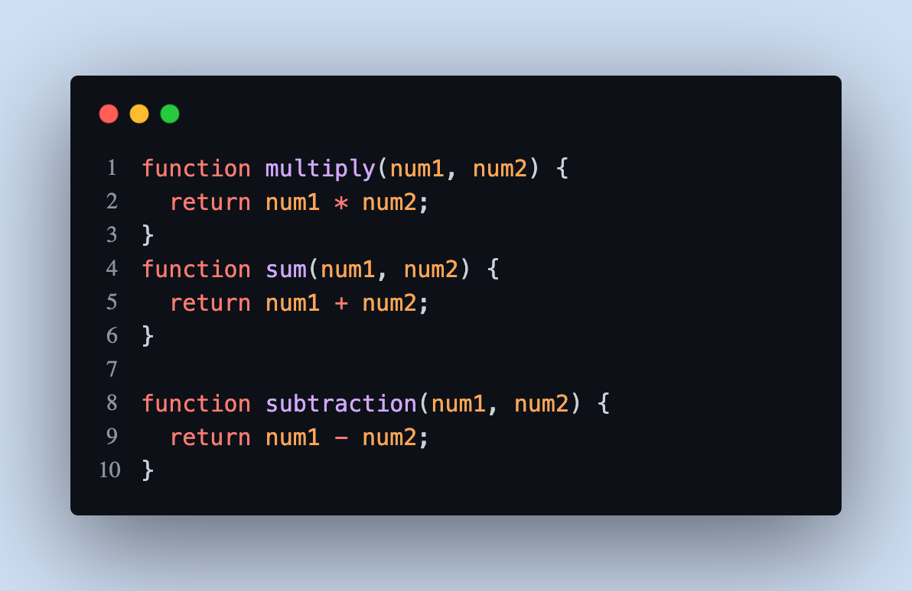

# Styling and Formatting Guide

 

## Table of Contents 

1. [Introduction](#introduction)
2. [Naming Conventions](#Naming_Conventions)
3. [Indentation & Spcacing](#Indentation_And_Spacing)
4. [Brackets & Colons](#objects-and-data-structures)
5. [Comments](#classes)
6. [Code Formatter](#solid)
<!-- 7. [Testing](#testing)
8. [Concurrency](#concurrency)
9. [Error Handling](#error-handling)
10. [Formatting](#formatting)
11. [Comments](#comments)
12. [Translation](#translation) -->

## Introduction

Well formatted code makes it easier to read and make errors more obvious. Code that is easy to read is easier to understand by you as well as other developers.\
It should be self-explanatory, easy to understand and easy to change or extend.

In this article, we will look at how and why code formatting is important.


## **Naming Conventions**

### Always use meaningful and descriptive names for variables and functions.

**Bad:**


**Good:**


**[⬆ back to top](#table-of-contents)**


## **Indentation-And-Spacing**

Always remember code is read more than they are written. Your code will run without indentation and spacing but it does makes your code easier to read and can help with finding errors in your code easier.

Below are some examples of how indentation and spacing is used with JavaScript. (CHECK WORDING)

### Variables
Variables should always start on the same line.

**Bad Indentation:**



**Good Indentation:**


### Functions
Also functions of the same level should alwasys start on the same line and keep spacing constant when writing code.

**Bad Indentation:**


**Good Indentation:**


**Bad Spacing:**



**Good Spacing:**


**[⬆ back to top](#table-of-contents)**

### Functions should do one thing

This is by far the most important rule in software engineering. When functions
do more than one thing, they are harder to compose, test, and reason about.
When you can isolate a function to just one action, it can be refactored
easily and your code will read much cleaner. If you take nothing else away from
this guide other than this, you'll be ahead of many developers.

**Bad:**

```javascript
function emailClients(clients) {
  clients.forEach(client => {
    const clientRecord = database.lookup(client);
    if (clientRecord.isActive()) {
      email(client);
    }
  });
}
```

**Good:**

```javascript
function emailActiveClients(clients) {
  clients.filter(isActiveClient).forEach(email);
}

function isActiveClient(client) {
  const clientRecord = database.lookup(client);
  return clientRecord.isActive();
}
```

**[⬆ back to top](#table-of-contents)**


### Remove dead code

Dead code is just as bad as duplicate code. There's no reason to keep it in
your codebase. If it's not being called, get rid of it! It will still be safe
in your version history if you still need it.

**Bad:**

```javascript
function oldRequestModule(url) {
  // ...
}

function newRequestModule(url) {
  // ...
}

const req = newRequestModule;
inventoryTracker("apples", req, "www.inventory-awesome.io");
```

**Good:**

```javascript
function newRequestModule(url) {
  // ...
}

const req = newRequestModule;
inventoryTracker("apples", req, "www.inventory-awesome.io");
```

**[⬆ back to top](#table-of-contents)**

## **Comments**

### How to leave comments like a pro!

Comments save time, help other developers navigate through your code and help your future self understand what you had written.\
\
Less is more when it comes to comments as good code should be self-documenting but comments can be very useful espically when learning to code.

#### As you can see from the examples below, comment overkill can be overwhelming and take to long to read through and understand.

**Bad:**


**Good:**


### Don't leave commented out code in your codebase

Version control exists for a reason. Leave old code in your history. (REWRITE)

**Bad:**

```javascript
doStuff();
// doOtherStuff();
// doSomeMoreStuff();
// doSoMuchStuff();
```

**Good:**

```javascript
doStuff();
```

**[⬆ back to top](#table-of-contents)**


