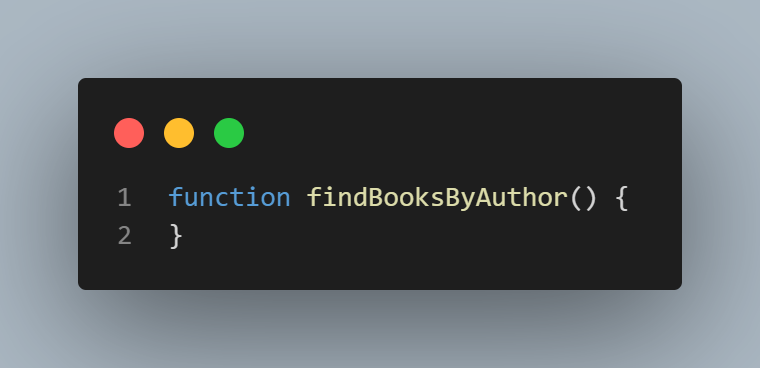

# Styling and Formatting Guide

## Table of Contents

1. [Introduction](#introduction)
2. [Naming Conventions](#Naming_Conventions)
3. [Indentation & Spcacing](#Indentation_And_Spacing)
4. [Brackets & Colons](#objects-and-data-structures)
5. [Comments](#classes)
6. [Code Formatter](#Code_formatters)

## Introduction

In this article, we will look at how to format your code and why it's important.
\
Code Formatting is not necessary for functionality but well formatted code is easier to read not just by you but other developers. It can also help make errors in your code more obvious.
\
Good code should be self-explanatory, easy to understand and easy to change or extend.

## **Naming Conventions**

### Always use meaningful and descriptive names for variables and functions.

#### Function Names

**Bad:**

**Good:**

#### Variable Names

**Bad:**

**Good:**

**[⬆ back to top](#table-of-contents)**

## **Indentation-And-Spacing**

Always remember code is read more than they are written. Your code will run without indentation and spacing but it does makes your code easier to read and can help with finding errors in your code easier.

Below are some examples of how indentation and spacing is used with JavaScript. (CHECK WORDING)

### Variables

Variables should always start on the same line.

**Bad Indentation:**

**Good Indentation:**

### Functions

Also functions of the same level should alwasys start on the same line and keep spacing constant when writing code.

**Bad Indentation:**

**Good Indentation:**

**Bad Spacing:**

**Good Spacing:**

## **Brackets-And-Semi_Colons**

### Brackets

There are three main types of brackets in javascript. They are parenthesis, square brackets and curly brackets. This section shows what they do and how you can use them.

#### Parenthesis ()

Parenthesis are mostly used to define function parameters but in some cases can also be used to define orders of evaluatin.

##### As you can see in the example below the parameters of the function are put in a parenthesis

When a function has a parameter it makes the function reuseable.

##### Parenthesis also define order of evaluation in calculations.

As you can see in the example above it evaluates 2+3 first (5) and then multiplies by 4 = 20.

##### Lastly, Parenthesis are required in For and While loops

The example below shows how parenthesis are used in both for and while loops.

For loop:

While loop:

#### Square Brackets

Square brackets are often use to define an array and also get items from an array.

The examples below shows how square brackets are used in javascript.

Defining an Array:

Getting an item in an Array:

**[⬆ back to top](#table-of-contents)**

## **Comments**

### How to leave comments like a pro!

Comments save time, help other developers navigate through your code and help your future self understand what you had written.\
This is espically true when you are learning, although less is more when it comes to comments, as good code should be self-documenting.

#### As you can see from the examples below, comment overkill can be overwhelming and take to long to read through and understand.

**Bad:**

**Good:**

**[⬆ back to top](#table-of-contents)**

## **Code Formatters**
